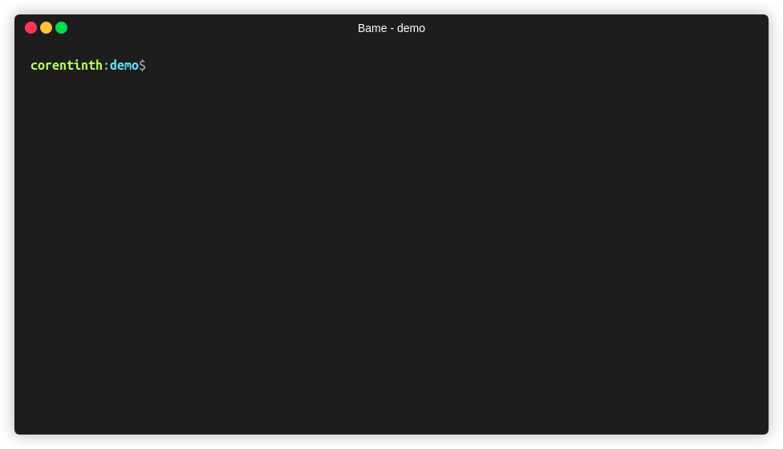

<p align="center">
    
</p>

-------

<p align="center">
    <a href="https://github.com/CorentinTh/bame/actions">
        
    </a>
    <a href="https://codecov.io/gh/CorentinTh/bame">
        
    </a>
</p>




## Bame ?

The word **bame** come frome the portmenteau between *batch* and *rename*. **Bame** is a simple cross-plateform cli that'll help you rename several files at once.  

## Usage
### Installation
**bame** can be installed using yarn or npm. It works for node version >= 8.

```shell
npm install -g bame
# or
yarn global add bame
```

### CLI

Simply run `bame` in the directory where the files you want to rename are located. Specify a regular expression with capturing groups (with parentesis) for the parts you want to keep while renaming. Then specify a string with the index of the capturing group you want to insert between braquets. 

For example:

```shell
bame 'SerieName Episode (.*) Season (.*).mp4' 'SerieName - S{1}E{2}.mp4'
# SerieName Episode 1 Season 1.mp4     -->     SerieName - S1E1.mp4
# SerieName Episode 2 Season 1.mp4     -->     SerieName - S1E2.mp4
# SerieName Episode 3 Season 1.mp4     -->     SerieName - S1E3.mp4
# SerieName Episode 4 Season 1.mp4     -->     SerieName - S1E4.mp4
```

Details and optional parameters:

```shell
Usage: bame <inReg> <outReg>

Options:
  -d, --no-dir   Should not rename directories                         [boolean]
  -q, --quiet    Rename silently                                       [boolean]
  -h, --help     Show help                                             [boolean]
  -v, --version  Show version number                                   [boolean]

Examples:
  bame "GoT Episode (.*) Season (.*)" "GOT.E{1}.S{2}"
```

### API
You can also integarte **bame** in som code:

```javascript
import { bame } from 'bame';

bame({
    inReg: 'GoT Episode (.*) Season (.*)',
    outReg: 'GOT.E{1}.S{2}',
    cwd: process.cwd(),
    options:{
        renameDir: true,
        verbose: true
    }
});
```

## Contribute
**Pull requests are welcome !** Feel free to contribute.

## Credits
Coded with ❤️ by [Corentin Thomasset](//corentin-thomasset.fr).

The demonstartion gif has been generated using [Terminalizer](https://github.com/faressoft/terminalizer)

## License
This project is under the [MIT license](./LICENSE).

